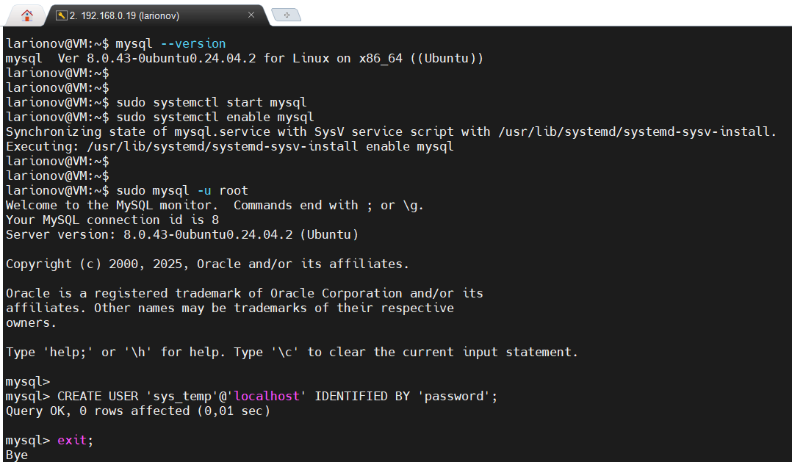
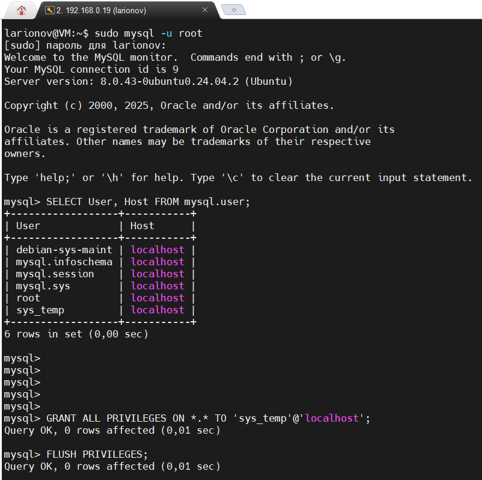
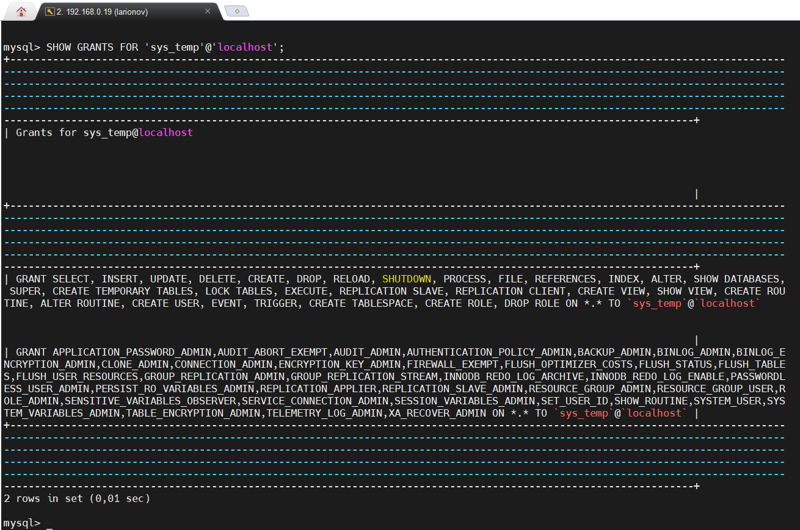
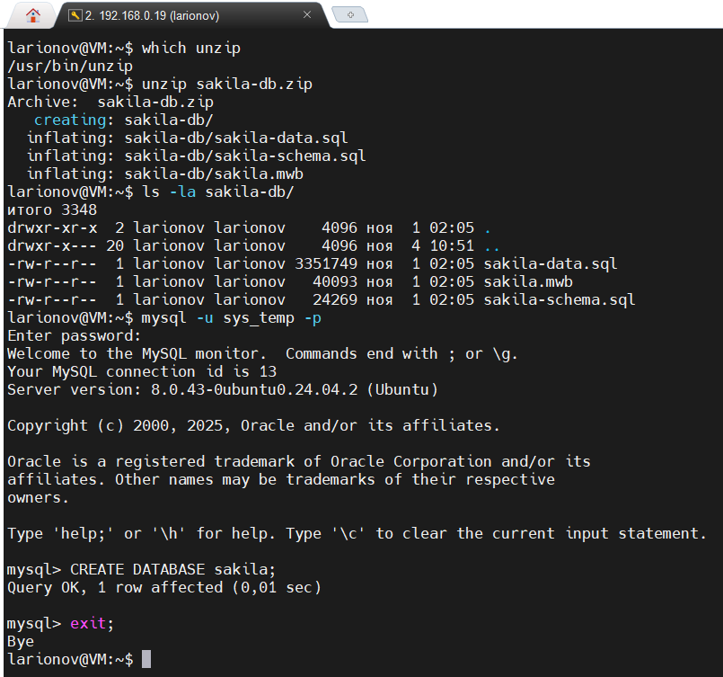
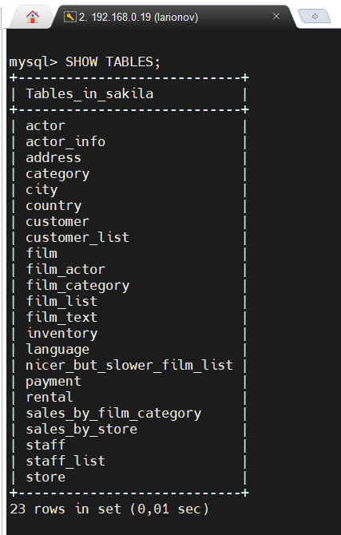
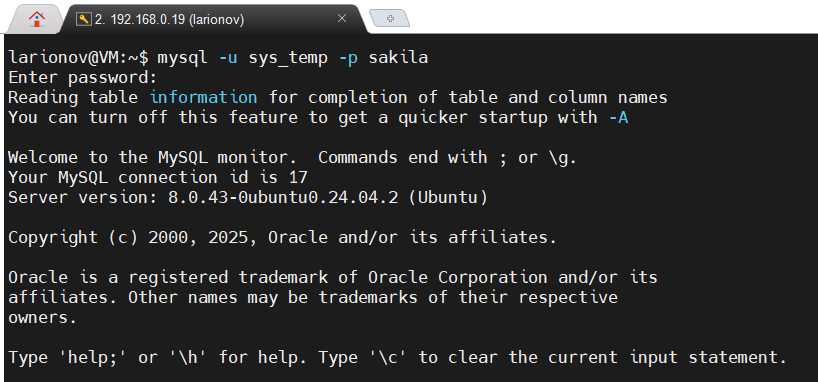
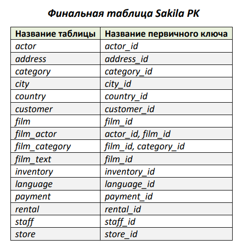

# <p align="center">Домашнее задание к занятию "Работа с данными (DDL/DML)"</p>

**SDBSQL-46 / Ларионов Сергей**

---

## Задание 1: mysql-sakila

Установка MySQL 8.0+:
```bash
sudo apt update
sudo apt install mysql-server
sudo systemctl start mysql
sudo systemctl enable mysql
mysql --version
```

Настройка MySQL (создание пользователя sys_temp с полными правами):
```bash
sudo mysql
CREATE USER 'sys_temp'@'localhost' IDENTIFIED BY 'password';
GRANT ALL PRIVILEGES ON *.* TO 'sys_temp'@'localhost' WITH GRANT OPTION;
FLUSH PRIVILEGES;
EXIT;
```

Проверка и установка unzip:
```bash
sudo apt update
sudo apt install unzip
which unzip
```

Скачивание и распаковка Sakila:
```bash
wget https://downloads.mysql.com/docs/sakila-db.zip
unzip sakila-db.zip
ls -la sakila-db/
```

Создание БД Sakila и импорт данных как sys_temp:
```bash
mysql -u sys_temp -p
(Пароль: *)
CREATE DATABASE sakila;
EXIT;
mysql -u sys_temp -p sakila < sakila-db/sakila-schema.sql
(Пароль: *)
mysql -u sys_temp -p sakila < sakila-db/sakila-data.sql
(Пароль: *)
```

Проверка (получение списка таблиц):
```bash
mysql -u sys_temp -p sakila
(Пароль: *)
SHOW TABLES;
```

#### Установка MySQL, запуск службы и создание пользователя


#### Отображение списка пользователей и выдача привилегий


#### Запрос на получение списка прав для sys_temp (выданы)


#### Процесс распаковки базы данных и создание БД sakila


#### Итоговый список таблиц в БД sakila (доказывает успешную загрузку)


---

## Задание 2: Первичные ключи в Sakila

Получение информации о первичных ключах таблиц базы данных Sakila:
```bash
mysql -u sys_temp -p sakila
(Пароль: *)
SELECT TABLE_NAME, COLUMN_NAME 
FROM INFORMATION_SCHEMA.KEY_COLUMN_USAGE 
WHERE TABLE_SCHEMA = 'sakila' AND CONSTRAINT_NAME = 'PRIMARY' 
ORDER BY TABLE_NAME;
EXIT;
```

Примечание: в результатах есть таблицы с составными первичными ключами (film_actor, film_category), для них указаны оба ключа через запятую, так как они вместе образуют первичный ключ.

#### Подключение к базе данных Sakila под пользователем sys_temp


#### Выполнение SQL-запроса для получения первичных ключей


#### Финальная таблица с первичными ключами всех таблиц


Или в таком виде:

| Название таблицы | Название первичного ключа |
|------------------|---------------------------|
| actor            | actor_id                  |
| address          | address_id                |
| category         | category_id               |
| city             | city_id                   |
| country          | country_id                |
| customer         | customer_id               |
| film             | film_id                   |
| film_actor       | actor_id, film_id         |
| film_category    | film_id, category_id      |
| film_text        | film_id                   |
| inventory        | inventory_id              |
| language         | language_id               |
| payment          | payment_id                |
| rental           | rental_id                 |
| staff            | staff_id                  |
| store            | store_id                  |

---
